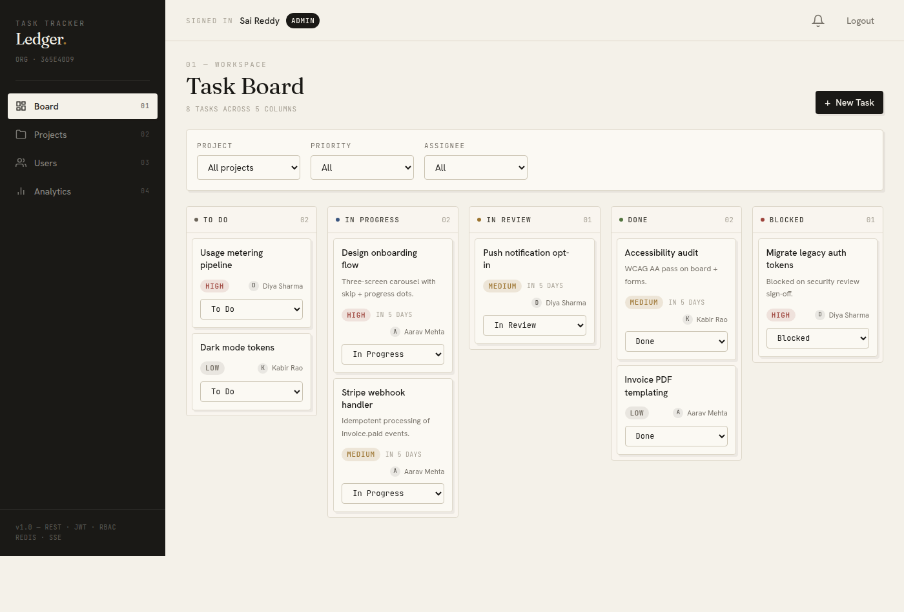
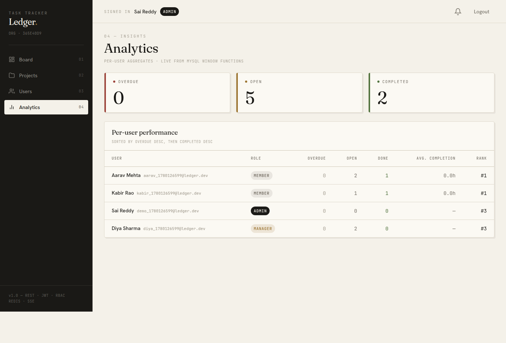
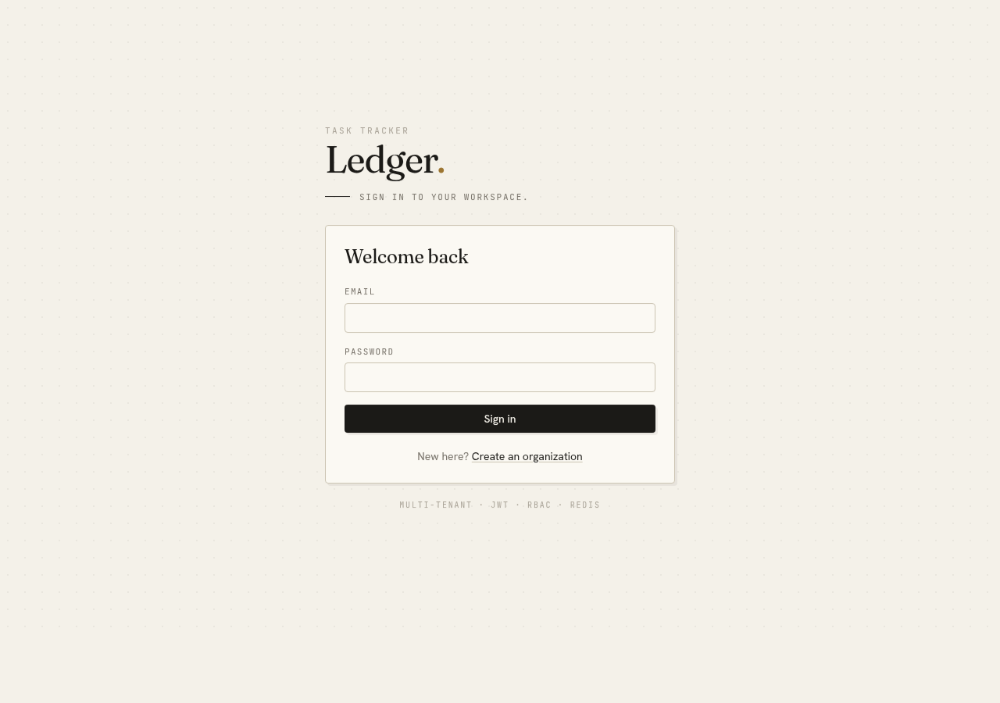
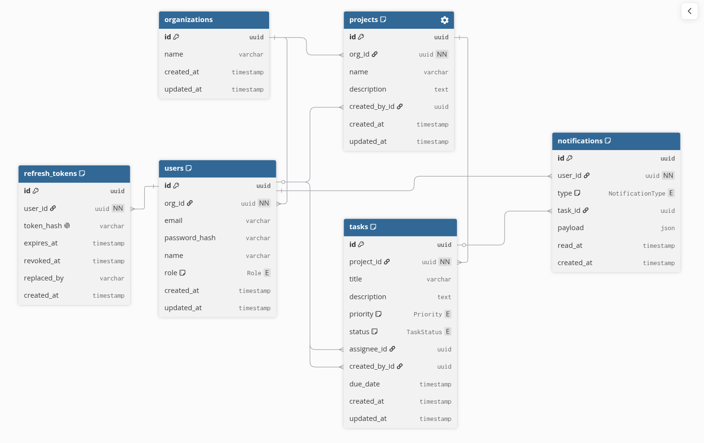

# Team Task Tracker API

REST API + React SPA for a team-based task tracker with multi-tenant orgs, JWT auth + refresh rotation, RBAC enforced at the middleware layer, Redis-backed caching, and real-time notifications over SSE.

**Backend:** Node.js · TypeScript · Express · Prisma · MySQL · Redis · Zod · Swagger · Jest · Docker
**Frontend:** React 18 · TypeScript · Vite · Redux Toolkit + RTK Query · React Router · Tailwind CSS

---

## Interface

A custom "Ledger" design system — editorial drafting-paper aesthetic, Fraunces/Hanken/JetBrains-Mono type, with colour reserved for semantic task signals.



<p align="center">
  
  
</p>

---

## Quick start

This stack uses **cloud-hosted MySQL + Redis** (e.g. Aiven, Redis Cloud), so Docker runs only the API.

```bash
cp .env.example .env
# edit .env — set DATABASE_URL and REDIS_URL to your own cloud MySQL + Redis
docker compose up --build
```

Docker builds and runs a single service:

| Service | Port | Purpose |
|---|---|---|
| `api`   | 3000 | Express API (runs `prisma migrate deploy` on boot, then starts) — reads `DATABASE_URL`/`REDIS_URL` from `.env` |

The `tasktracker` database must already exist on your MySQL host; `migrate deploy` creates the tables.

Once it's up:

- API base — http://localhost:3000
- Health   — http://localhost:3000/health
- **Swagger UI** — http://localhost:3000/docs
- **OpenAPI JSON** — http://localhost:3000/docs/openapi.json
- **Postman collection** — `docs/postman-collection.json` (or import the OpenAPI URL above directly in Postman)
- SSE stream — `ws`-style `GET /notifications/stream?token=<jwt>` (use `EventSource` in a browser, or `curl -N`)

### Frontend (in a second terminal)

```bash
cd frontend
npm install
npm run dev   # → http://localhost:5173
```

Vite proxies `/api/*` and `/notifications/stream` to the backend on `:3000`, so the SPA uses relative URLs. Open http://localhost:5173, **Register** a new org (you become ADMIN), then explore Board / Projects / Users / Analytics. The notification bell updates in real time over SSE as soon as someone assigns you a task or moves your task's status.

For a production-style build:

```bash
cd frontend
npm run build           # writes dist/
npm run preview         # serves dist/ on :4173
```

---

## Architecture overview

```
┌────────────────┐    HTTP     ┌──────────────────────────┐
│  Browser/API   │ ──────────▶ │   Express + TS  (api)    │
│   consumer     │             │                          │
│                │ ◀ SSE ───── │  ┌──── Prisma client ──┐ │       ┌─────────┐
└────────────────┘             │  │                      │─┼─────▶│ MySQL 8 │
                               │  └──────────────────────┘ │      └─────────┘
                               │  ┌──── ioredis ─────────┐ │       ┌─────────┐
                               │  │ cache + pub/sub      │─┼─────▶│  Redis  │
                               │  └──────────────────────┘ │      └─────────┘
                               └──────────────────────────┘
```

Each request → JWT middleware → RBAC middleware → Zod validation middleware → controller → service → Prisma. Errors bubble up to a single global error filter that emits the consistent `{status, code, message, details?}` shape.

---

## Database schema



Interactive: [dbdiagram.io](https://dbdiagram.io/d/6a184962b62396d22c90e4e9) · DBML source: [`docs/schema.dbml`](./docs/schema.dbml) · Prisma: [`prisma/schema.prisma`](./prisma/schema.prisma)

Six models:
- `organizations` — tenancy boundary
- `users` — `(orgId, email)` unique per org so the same person can exist in multiple orgs
- `projects` — owned by an org; cascade-deletes to tasks
- `tasks` — title, priority, status, assignee (nullable), due date
- `refresh_tokens` — SHA-256 hashed, with rotation chain via `replacedBy`
- `notifications` — persisted + JSON payload for type flexibility

### Design decisions

**1. UUID primary keys (CHAR(36)) instead of `INT AUTO_INCREMENT`.**
Removes IDOR risk (you can't guess `/tasks/2` to find another org's task), keeps multi-tenant data merge-safe, and matches modern API conventions.

**2. Composite index `(assigneeId, status)` on `tasks`.**
The single hottest query is a MEMBER's task board: *"my open tasks"*. A single-column index on `assigneeId` would still scan every row of theirs to filter by status; the composite turns it into an index-only seek. Combined with `(projectId, status)` for project-scoped boards.

**3. Refresh tokens stored as SHA-256 hashes with a rotation chain.**
A DB leak doesn't hand attackers usable tokens (they only see hashes), and `replacedBy` lets us detect token reuse: if a revoked refresh token is presented, we revoke the entire chain belonging to that user, forcing re-login on all devices. Standard OWASP defence against stolen tokens.

**4. `Notification.payload` is JSON, not normalized columns.**
Notification types will grow (mentions, comments, due-soon reminders). JSON lets each type carry its own shape without 5 nullable columns per new type. Tradeoff: can't query inside payload efficiently — acceptable since notifications are append-only and rarely filtered by content.

**5. `assigneeId` nullable + `onDelete: SET NULL`.**
Deleting a user must not cascade-delete their task history. Tasks survive as unassigned, audit/who-did-what queries still work.

---

## RBAC matrix

RBAC is enforced via `requireRole(...roles)` middleware (`src/middlewares/rbac.ts`), **never** in controllers.

|                                  | ADMIN | MANAGER | MEMBER |
|---|:-:|:-:|:-:|
| Auth: register / login / refresh | ✓ | ✓ | ✓ |
| Invite users into org            | ✓ |   |   |
| List org users                   | ✓ | ✓ | ✓ |
| Change user role / delete user   | ✓ |   |   |
| Projects: list / get             | ✓ | ✓ | ✓ |
| Projects: create / update / delete | ✓ | ✓ |   |
| Tasks: list / get                | ✓ | ✓ | ✓ (own only) |
| Tasks: create / update / delete  | ✓ | ✓ | ✓ (own only, no reassign) |
| Tasks: advance status            | ✓ | ✓ | ✓ (only if assignee) |
| Notifications: read own          | ✓ | ✓ | ✓ |
| Analytics: per-user metrics      | ✓ | ✓ |   |

**Status transitions** are enforced server-side, not free-form:

```
TODO ──▶ IN_PROGRESS ──▶ IN_REVIEW ──▶ DONE   (terminal)
   │           │              │
   └───────────┴──────┬───────┘
                  BLOCKED ◀──▶ {TODO | IN_PROGRESS | IN_REVIEW}
```

DONE is terminal. Reopening from BLOCKED can return to any active state.

---

## Caching strategy

**Key shape:** `tasks:assignee:{assigneeId}:{md5(queryString)}`

**Why per-assignee namespace:**
- A MEMBER's task board is the spec-required hot query.
- Invalidation when a task changes only needs to wipe the affected assignee's namespace — not the entire `tasks:*` cache.
- `SCAN MATCH` by prefix is O(matching keys), bounded.

**What is cached:**
- `GET /tasks` requests **with** an assignee filter (either explicit UUID or `assigneeId=me`, plus the MEMBER role's implicit self-filter).
- Org-wide listings without assignee filter are NOT cached — would require a much broader invalidation surface for marginal benefit.

**TTL:** 60s by default (`CACHE_TTL_SECONDS`). Cache is defence-in-depth read-shedding, not the source of truth — even if invalidation misses, staleness is capped.

**Invalidation triggers** (in `src/modules/tasks/tasks.service.ts`):

| Action | Invalidates |
|---|---|
| `POST /tasks`             | new assignee's namespace |
| `PATCH /tasks/:id`        | **old** assignee + **new** assignee (covers reassignment) |
| `PATCH /tasks/:id/status` | assignee's namespace |
| `DELETE /tasks/:id`       | assignee's namespace |

Verify the lifecycle yourself with the included inspector:

```bash
node scripts/cache-inspect.mjs "tasks:assignee:<userId>:*"
```

---

## Real-time notifications

Uses **SSE** (Server-Sent Events), not WebSocket — because notifications are server-push only, so a full-duplex socket (and the socket.io dependency) would be overkill.

**Flow:**
1. Task status changes or task is assigned → API persists a row in `notifications`
2. API publishes the notification JSON to Redis channel `notifications:{userId}`
3. Each connected SSE client has its own Redis subscriber on that channel
4. On Redis `message` → client receives an `event: notification` chunk

If the user is offline, the push is lost — but the notification is still in the DB, so a subsequent `GET /notifications` returns it. The pub/sub is the real-time hint; MySQL is the source of truth.

**Auth:** the JWT is sent in an `Authorization: Bearer` header, not in the URL. The native `EventSource` API can't set headers, so the React client streams over `fetch` + `ReadableStream` instead (parsing the `text/event-stream` frames manually, the same idiom the OpenAI/Anthropic streaming clients use) and reconnects with a 3s backoff. This keeps access tokens out of server/proxy logs and browser history. The endpoint also accepts a `?token=` query param as a fallback for raw `EventSource`/`curl` clients.

**Client example (fetch streaming, header auth):**

```js
const res = await fetch('/notifications/stream', {
  headers: { Authorization: `Bearer ${accessToken}`, Accept: 'text/event-stream' },
});
const reader = res.body.getReader();
// → read(), split frames on "\n\n", parse `event:`/`data:` lines
```

---

## Deletion strategy

**Currently: hard delete with reassign.**

- `DELETE /users/:id` reassigns `createdById` of the user's tasks/projects to the deleting ADMIN before removing the row.
- Cannot delete yourself; cannot delete the last ADMIN.
- `DELETE /projects/:id` cascade-deletes child tasks (FK rule at the DB layer).
- `DELETE /tasks/:id` removes the row outright (notifications keep their `taskId` as a soft reference via `onDelete: SetNull`).

**Why not soft delete?** Soft delete (`deletedAt`) is only valuable when paired with a Trash / restore UI. Without restore, you pay the cost (extra column, every query needs `WHERE deletedAt IS NULL`, MySQL can't do partial unique indexes for `(orgId, email)`) for zero user-visible benefit.

**Future:** the production pattern is two-stage delete — immediate soft-delete to a Trash bucket, then a cron job hard-deletes after a retention window (30/60/90d). See [`docs/FUTURE_WORK.md`](./docs/FUTURE_WORK.md).

---

## Error response shape

Every endpoint returns errors in the same shape (from `src/middlewares/error-handler.ts`):

```json
{
  "status": 400,
  "code": "VALIDATION_ERROR",
  "message": "dueDate: dueDate must be a future date",
  "details": [{ "field": "dueDate", "message": "dueDate must be a future date" }]
}
```

Known error codes: `VALIDATION_ERROR`, `UNAUTHORIZED`, `FORBIDDEN`, `NOT_FOUND`, `CONFLICT`, `INVALID_STATUS_TRANSITION`, `ASSIGNEE_NOT_IN_ORG`, `LAST_ADMIN`, `ROUTE_NOT_FOUND`, `FOREIGN_KEY_VIOLATION`, `INTERNAL_ERROR`.

Prisma errors (P2002, P2003, P2025) are mapped to human-friendly codes so clients never see raw Prisma stack traces.

---

## What I'd add given more time

See [`docs/FUTURE_WORK.md`](./docs/FUTURE_WORK.md) for the full list. Highlights:

1. **Two-stage soft delete** with a Trash UI bucket + cron-driven hard delete after a retention window, plus GDPR-compliant PII anonymization on right-to-be-forgotten requests.
2. **Message queue (RabbitMQ or Kafka) alongside Redis pub/sub.** Redis stays for low-latency real-time UI; the queue handles "must eventually run" workloads — notification email digests, due-date reminder cron, webhook delivery to external integrations.
3. **Immutable audit log table** that survives even hard deletes — required for compliance.
4. **Per-user rate limiting** (express-rate-limit + Redis store).
5. **Harden token storage to `httpOnly` cookies.** The SPA currently keeps the JWT in `localStorage` and sends it as a `Bearer` header (consistent across REST + the fetch-based SSE stream — no tokens in URLs). `localStorage` is readable by JavaScript, so it's exposed to XSS token theft. The production-grade move is `httpOnly` + `Secure` + `SameSite` cookies that JS can't read, paired with CSRF protection and CORS `credentials` — I kept Bearer here to stay consistent and avoid a half-migrated auth model under the time box. For SSE specifically I'd also issue single-use, short-TTL stream tickets rather than reusing the access token.
6. **Distributed tracing** (OpenTelemetry → Jaeger) so request paths through middleware/service/DB are observable.
7. **Drag-and-drop kanban** on the task board (currently uses a status dropdown per card).
8. **Comments, attachments, full-text search** (Meilisearch) on tasks.

---

## Local development (without Docker)

To run the API directly with Node (no Docker), against the same cloud DB/Redis:

```bash
npm install
cp .env.example .env
# edit .env to point DATABASE_URL/REDIS_URL at your own DB/Redis
npx prisma migrate dev
npm run dev
```

Then the server hot-reloads on changes.

---

## Project layout

```
team-task-tracker/
├── docker-compose.yml          # api only (cloud MySQL + Redis via .env)
├── Dockerfile                  # multi-stage build
├── prisma/
│   ├── schema.prisma           # source of truth
│   └── migrations/             # versioned SQL
├── docs/
│   ├── er-diagram.png          # generated from schema.dbml
│   ├── schema.dbml             # dbdiagram.io source
│   ├── postman-collection.json # importable into Postman
│   └── FUTURE_WORK.md
├── scripts/
│   ├── cache-inspect.mjs       # redis key inspector
│   └── gen-postman.mjs         # regenerate postman collection
├── src/                        # ── Backend (Express + TS) ──
│   ├── index.ts                # entry
│   ├── app.ts                  # express bootstrap
│   ├── config/                 # env, logger, prisma, redis, openapi
│   ├── middlewares/            # auth, rbac, validate, error-handler
│   ├── utils/                  # errors, tokens, password, cache, async-handler
│   └── modules/
│       ├── auth/               # register, login, refresh rotation
│       ├── users/              # list / change role / delete (with reassign)
│       ├── projects/           # CRUD + RBAC
│       ├── tasks/              # CRUD + status state machine + caching
│       ├── notifications/      # persisted + SSE stream
│       └── analytics/          # per-user overdue / done / rank
└── frontend/                   # ── Frontend (React + Vite + RTK Query) ──
    ├── vite.config.ts          # dev proxy → :3000
    ├── tailwind.config.js      # dark theme
    └── src/
        ├── main.tsx            # router + Redux Provider
        ├── app/                # store, RTK Query api, typed hooks
        ├── features/
        │   ├── auth/           # authSlice (tokens persisted to localStorage)
        │   └── notifications/  # useSSE hook
        ├── components/         # AppLayout, NotificationBell, Modal, RequireAuth
        ├── pages/              # Login, Register, Board (kanban), Projects, Users, Analytics
        └── lib/                # types, error helpers
```

---

## License

MIT
